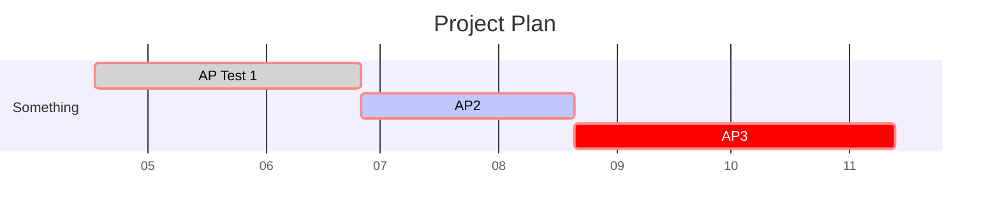

---
aliases:
tags:
- object/info
created: 2025-05-30
type:
  - "[[Class Gantt Chart]]"
context:
  - "[[PRJT - Sample Project]]"
status: "[[DONE]]"
---
# Content
## Description
The mermaid code in this file (see section [[#Gantt]]) generates a gantt chart. 
If you want to learn more about how the diagram works you can read up on it on the [official Mermaid site](https://mermaid.js.org/syntax/gantt.html). Or check out the article [Gantt-charts in Obsidian through Mermaid](https://nosy.science/2025/04/29/gantt-charts-in-obsidian-through-mermaid/) on [Nosy.Science](https://nosy.science/) to learn more about the use of gantt charts in [O3PM](https://nosy.science/2025/05/10/object-oriented-management-in-obsidian-o3pm/).

## Gantt

